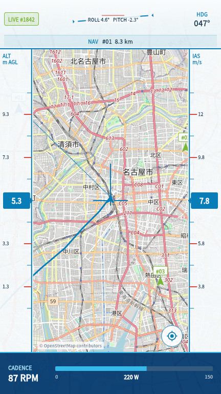

# WASA FEE Instrument Display

Flight Environment Emulator（FEE）が送る飛行状態を、別の端末の地図上に表示するFlutterアプリです。リポジトリ名の `instrunment_app` は既存名のため維持しています。

## UI



デモ用テレメトリを使ってレンダリングした画面です。地図データ: [© OpenStreetMap contributors](https://www.openstreetmap.org/copyright)

画面構成と操作の詳細は[統合計器盤 UI要件](docs/ui-requirements.md)を参照してください。

## できること

- UDPで受信した現在位置・機首方位を地図に表示
- 自機を中央・機首方向を上に保つ統合計器盤を表示
- ナビポイントの追加・選択と残距離の表示
- 最大600点の飛行軌跡を表示
- 高度、対気速度、ペダル出力を単位付きで表示
- 2秒以上受信が途切れた場合に「通信停止」と表示
- 不正なJSON、未知の形式、範囲外の緯度経度を破棄
- Android、iOS、macOSでローカルネットワークを受信

この公開リポジトリには表示に必要な通信形式だけを置きます。FEE本体、機体形状、空力データ、チーム内IPアドレス、認証情報は置きません。

## 確認環境

GitHub Actionsでは2026-07-15にFlutter 3.44.6でformat、analyze、testを確認しています。これは再現用のCI基準版です。新しいFlutter stableを使う場合は、同じ3検査を通し、動作確認日と版をPRへ記録してください。端末とFEEを組み合わせた実機確認はDraft PRの未完了項目です。

## 初めて使う人へ

1. [Flutter公式手順](https://docs.flutter.dev/get-started/install)でFlutter stableをインストールします。
2. このリポジトリのフォルダーで `flutter pub get` を実行します。
3. 表示端末とFEE実行PCを同じローカルネットワークへ接続します。
4. 非公開FEE側の設定画面でテレメトリを有効にし、送信先へ表示端末のIPアドレスを入力します。
5. `flutter run` を実行します。
6. OSやファイアウォールから確認された場合は、ローカルネットワーク上のUDP受信を許可します。

アプリは全IPv4インターフェースのUDP `5503` 番ポートで待機します。送信形式は `wasafee.flight-telemetry` version 1です。アプリ画面が「待機中」のままなら、同一ネットワーク、FEE側の送信先IP、UDP 5503のファイアウォール設定を順に確認してください。

## 開発

```bash
flutter pub get
dart format --output=none --set-exit-if-changed lib test
flutter analyze
flutter test
```

変更はIssueから始め、ブランチ、Draft PR、レビュー済みPRの順で進めてください。GitHub ActionsはPRごとにformat、analyze、testを実行します。

## 公開リポジトリの安全ルール

コミット前に、次が含まれていないことを必ず確認してください。

- `.env`、APIキー、パスワード、個人情報
- チーム内で固定利用するIPアドレス
- 非公開FEEのソースコード、機体モデル、質量、正式な空力値
- 実験ログや位置履歴

公開可否が判断できないものはコミットせず、Issueで確認してください。
